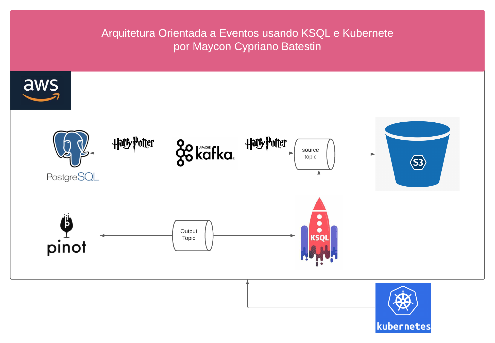

<h1 align="center">

<h3> 
ARQUITETURA ORIENTADA A EVENTOS  
 </h3>
<h3> 
 ================= 
 </h3>

>> <h3> Arquitetura da solução </h3>

 Neste projeto cria-se um banco de dados faker de personagens ficticios de Harry Potter. Como trata-se de uma arquitetura orientada a eventos, não seria possível tratar com os verdadeiros personagens da série literária, uma vez que os eventos aqui tendem a ser na casa de Gigabytes. Este projeto usa uma orquestração Kubernetes, o Kafka Stream para fazer ingestão de dados no banco PostgreeSQL e também no bucket S3. Além disso, usamos o Pivot para realizar consultas customizadas de nosso banco de dados. 

